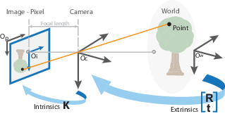

## Calibration

Camera parameters include intrinsics, extrinsics, and distortion coefficients. The key point of calibration is to determine these parameters shown above to build up the model of camera. By using the camera model, one could determine the relation between the points' position on the 3-D objects and the pixels on the images.

The accuracy really matters.

#### Pinhole Camera Model

The pinhole model is shown below:

The parameters are represented in a 4-by-3 matrix called the *camera matrix*. This matrix maps the 3-D to the image plane.

The extrinsic parameters represents the location of the camera in the 3-D scene.

The intrinsic parameters represents the optical center and focal length of the camera. (Given by the camera itself)

RELATIONS: World points -- (extrinsic paras) --> camera coordinates -- (intrinsic paras) --> image plane

#### Camera Calibration Parameters

To begin, lets emphasize the meanings and scales of parameters. The extrinsic parameters represent a **rigid** transformation from 3-D world coordinate system to the 3-D camera's coordinate system. The intrinsic parameters represent a **projective** transformation from the 3-D camera's coordinate into the 2-D image coordinates.

##### Extrinsic Parameters

The origin of the camera's coordinate system is at its optical center and its *x-* axis and *y-* axis define the image plane.

##### Intrinsic Parameters

The intrinsic parameters include the focal length, the optical center, also known as the *principle point* , and skew coefficient. *K* is defined as:
$$
\begin{bmatrix}
	f_x & 0 & 0 \\ s & f_y & 0 \\ c_x & c_y & 1
\end{bmatrix}
$$
NOTES:

$[c_x \  c_y]$ -- optical center in pixels

$(f_x,f_y)$ -- Focal length in pixels. where $f_x = F/p_x ,f_y = F/p_y$

$F$ -- Focal length in world units, typically expressed in millimeters.

$(p_x,p_y)​$ -- Size of the pixel in world units.

$s$ -- Skew coefficient, which is non-zero if the image axes are not perpendicular. $s = f_y \tan\alpha$

[1]: https://www.mathworks.com/help/vision/ug/camera-calibration.html

