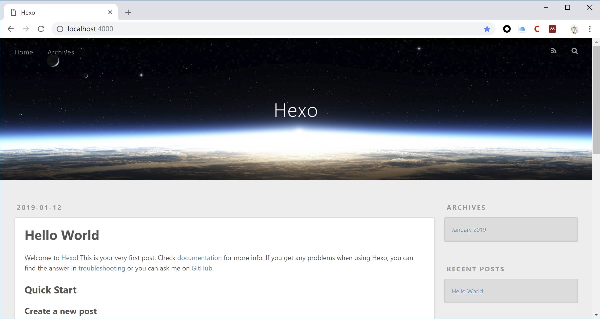
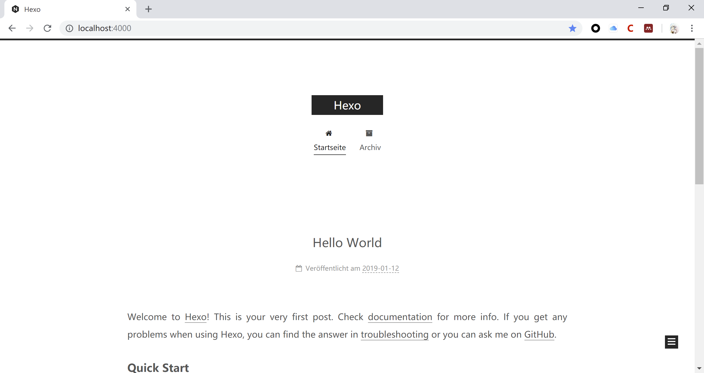
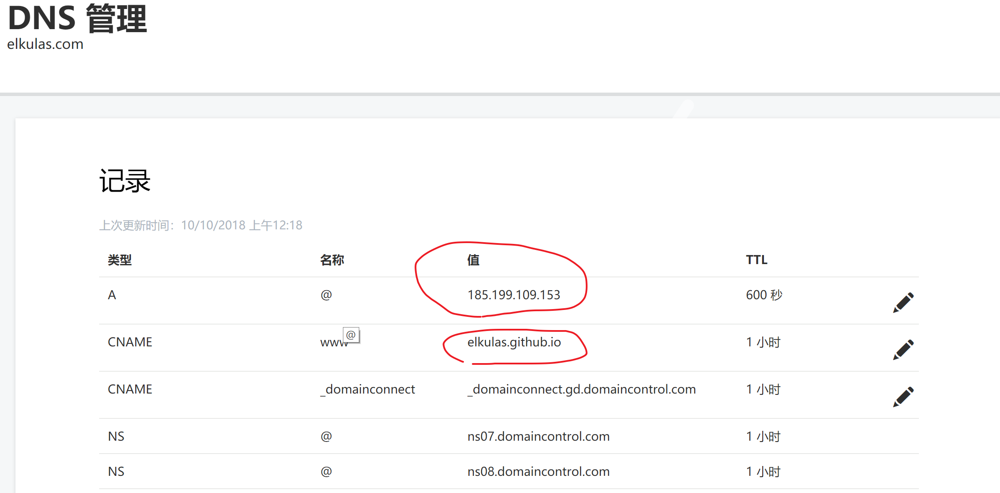
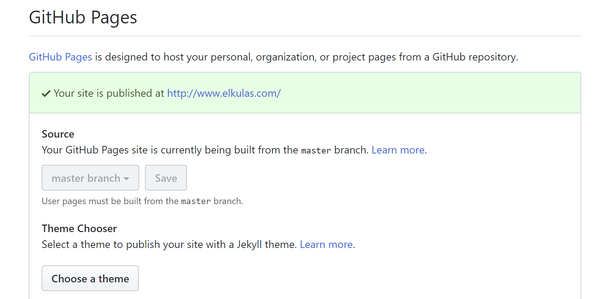

## 为什么搭建

目前市面上有较多的商用博客可以使用，比如简书与Medium都是优秀的平台。但自己搭建的博客比较自由，不受太多的约束，并且在中间可以学到较多的东西。在以后的简历中也可以进行附加来作为一项技能和展示能力的平台。

### 框架选择

当然我们不需要从头开始一点一点自己用``html``来进行网站的搭建。目前市面上有较多的优秀框架。我们只需要进行部署、配置便可以进行使用。对于展示而言使用框架是最方便且可维护性较高的，同时网上有较多的教程以及问题解决。目前常见的平台有[Hexo](https://hexo.io/zh-cn/) 、[Ghost](http://www.ghostchina.com/) 以及[Wordpress](https://cn.wordpress.org/) 。其中Hexo与Ghost可以使用markdown来进行文章的写作，比较适合轻量级的博客写作。

### 部署方案

这里可以使用两种部署方案：

1. Github
2. VPS

Github每一个账号只能有一个仓库来存放个人主页，而且仓库的名字必须是username/username.github.io。在创建仓库结束之后便可以使用[http://username.github.io](http://username.github.io/) 来访问你的个人主页。

对于VPS方法，可以向服务器供应商租用服务器，然后在属于自己的服务器上进行网页搭建。常用的服务器供应商有Vultr，Bandwagon以及阿里云腾讯云等等。

这里我们选择使用Github.


## 系统环境配置

首先我们在本地实现Hexo网页渲染。要使用Hexo，首先系统需要支持Nodejs以及Git。

以下过程主要是对于windows环境，对于linux以及macos差别不是很大，可以参考。

### 安装Node.js

[下载地址](https://nodejs.org/download/) [参考地址](http://www.runoob.com/nodejs/nodejs-install-setup.html)

### 安装Git

[下载地址](https://git-scm.com/download/) 关于Git的教程，这边推荐一下[廖雪峰的Git教程](https://www.liaoxuefeng.com/wiki/0013739516305929606dd18361248578c67b8067c8c017b000)，对于Git入门有较大帮助 

### 安装Hexo

首先在指定目录下新建一个文件夹，比如叫做Hexo。在文件夹内部右键打开Git Bash（Git Bash Here）

安装Hexo

```shell
$ npm install hexo-cli -g
```

在blog目录下初始化Hexo，当然也可以是你定义的名字

```shell
$ hexo init blog
```

进入博客根目录，安装插件以及依赖

```shell
$ cd blog
$ npm install
```

安装完毕之后进行本地渲染，并在本地跑一个server观察渲染状态

```shell
$ hexo g # 本地渲染
$ hexo s # 本地server观察效果
```

完成以上两步之后窗口如下


按照提示可以打开[http://localhost:4000](http://localhost:4000)，便可以看到本地渲染的Hexo网页。



那么恭喜，Hexo已经可以完成本地的静态渲染，下一步就是将本地渲染后的文件发布到服务器上。

这里提一下Hexo常用的指令：

1. ``hexo generate (hexo g)`` 生成静态文件，会在当前目录下生成一个新的叫做public的文件夹
2. ``hexo server (hexo s)`` 启动本地web服务，用于博客的预览
3. ``hexo deploy (hexo d) ``部署播客到远端（比如github, heroku等平台）

对于更多的Hexo指令，可以参见[Hexo官方文档](https://hexo.io/zh-cn/docs/)。


## Hexo主题设置

Hexo框架另一个重要特性就是可以使用多种多样的主题，同时自己也可以设置属于自己的主题并上传分享。[官方网站](https://hexo.io/themes/)上便有许多的主题模板，通过下载便可以进行主题安装。目前默认的主题是Landscape，这里我使用[NexT](https://github.com/theme-next/hexo-theme-next)作为例子进行示例。

在当前目录下下载主题

```shell
$ hexo clean
$ git clone https://github.com/theme-next/hexo-theme-next themes/next
```

完成这步之后再Themes文件夹下便会出现next的主题文件夹。

打开blog目录下的``_config.yml``文件，找到关于Themes的配置，将其改为next。

```yaml
# Extensions
## Plugins: https://hexo.io/plugins/
## Themes: https://hexo.io/themes/
theme: next
```

更新主题并生成

```shell
$ cd themes/next
$ git pull
$ hexo g # 生成
$ hexo s # 启动本地web服务器
```

现在打开<http://localhost:4000/> ，会看到我们已经应用了一个新的主题。



关于NexT这个主题有较多的学习材料，并且NexT有很多有意思的插件以及优化方法，这里大家可以自行去探索。


## 部署Hexo至Github Pages

相比于一些VPS，使用[Github Pages](https://pages.github.com/)的优势是免费稳定。再继续之前，需要保证一些基本的Github操作，如建立库，更新库，SSH key配置等等。可以参照[廖雪峰的Git教程](https://www.liaoxuefeng.com/wiki/0013739516305929606dd18361248578c67b8067c8c017b000)以及[使用GitHub Pages建独立博客](http://beiyuu.com/github-pages)。 

### 创建Github Pages

在自己的库中创建项目库，库的名称为``你的用户名.github.io``，在创建好库之后，提交一个``index.html``文件, 然后``push``到Github上的``master``分支上，此时便可以生成页面。 

在页面生效之后，便可以使用``你的用户名.github.io``来访问页面。初始界面如[beiyuu.github.io](http://beiyuu.github.io/)所示。

### 使用Hexo d进行部署

在继续之前先讲一下部署的原理。之前步骤中创建的项目库``你的用户名.github.io`` 一个最大的特点，就是``master``分支下的``html``静态文件，可以通过外部链接``你的用户名.github.io``来进行直接访问。而在本地``hexo g``可以本地渲染生成一个静态的网站，同时，这个静态的文件可以进行直接访问。因此我们部署的本质就是将本地的静态文件提交（``git commit``）到Github上。

我们进行部署使用的指令是``git deploy``， 倘若我们部署到Github上，我们需要对配置文件``_config.yml``中作以下修改：

```shell
# Deployment
## Docs: https://hexo.io/docs/deployment.html
deploy:
  type: git
  repository: https://github.com/Elkulas/Elkulas.github.io.git
  branch: master
```

其中这里库的名字需要改成自己用户名的名字。

在完成之后，在命令行中执行

```shell
$ hexo d
```

便可以完成部署

**NOTICE**

1. 注意需要提前安装这个扩展

```shell
$ npm install hexo-deployer-git --save
```

1. 如果出现下面这样的错误，

```shell
Permission denied (publickey).
fatal: Could not read from remote repository.

Please make sure you have the correct access rights
and the repository exists.
```

则是没有设置好本机的Public Keys的缘故，需要再重新进行本机的SSH配置。

**至此**，可以通过``你的用户名.github.io``来进行网站访问


## 购买与绑定域名

当然做到这一步还是不够的，比如每次向别人发送个人网站时候，后面总会带有一串``github.io``，虽然不影响使用，但是看起来不是特别好看。因此，最重要的美化就是使用域名。

### 购买域名

目前有较多的域名提供商可以选择，比如阿里系下的[万网](https://wanwang.aliyun.com/)，以及一些别的国外域名商，如[GoDaddy](https://sg.godaddy.com/offers/domains/godaddy-b/cnfos?isc=gennlcn03&countryview=1&currencyType=CNY&gclid=Cj0KCQiAvebhBRD5ARIsAIQUmnmLn0Jm7AewRcXooNt3Tkpxuef8EfIKscTuZVmr1alLdNpbWUmIQm8aAqWAEALw_wcB&gclsrc=aw.ds)等。通过这些网站可以购买相应的域名。其中.com域名是最贵的，也是逼格最高的。对于日常使用而言其实没有必要购买.com域名，使用.top或者.net都可以。而且，字母越短越贵，所以大家可以好好考虑一下。


这里我以Elkulas为例，在GoDaddy平台上进行域名购买与配置。当然这些配置流程在万网上也是一样的，同时网上也有较多的教程可以参考。

### 域名绑定

进入购买之后的域名管理器界面，对购买的域名进行DNS解析。



将红圈内的内容分别修改为``你的用户名.github.io``的ip地址以及``你的用户名.github.io``。对于ip地址，可以使用ping 的方法进行获取。

保存之后，进入Github中，在``github.io``项目库的设置中找到如下的设置项，将购买后的域名填入。



这里因为已经绑定所以会如图所示。随后在本地的Hexo目录下的source文件夹内，新建一个名字为``CNAME``的文件，文件内写入你购买的域名名称。保存，然后进行Git提交。当然你也可以使用以下的方式进行设置。

```shell
$ cd source/
$ touch CNAME
$ vim CNAME # 输入你的域名
$ git add CNAME
$ git commit -m "add CNAME"
```

配置结束之后便实现了域名与Github Pages的成功绑定


## Further

1. 之后便是写文章的部分了。对于写文章的部分可以参考[这篇博客](https://www.jianshu.com/p/6584a04ccadd)以及官方的[教程](https://hexo.io/zh-cn/docs/)。对于Markdown，个人推荐使用[Typora](https://www.typora.io/)作为editor。
2. 对于图片如何插入可以参考[这篇博客](https://blog.csdn.net/sugar_rainbow/article/details/57415705)。
3. 对于Hexo界面的超级优化可以参考[这篇博客](https://reuixiy.github.io/technology/computer/computer-aided-art/2017/06/09/hexo-next-optimization.html)
4. 倘若希望自己在自己服务器搭建网页，推荐使用阿里云，vultr服务器很容易被ban掉。具体可以参考[这篇博客](https://eliyar.biz/how_to_build_hexo_blog/)