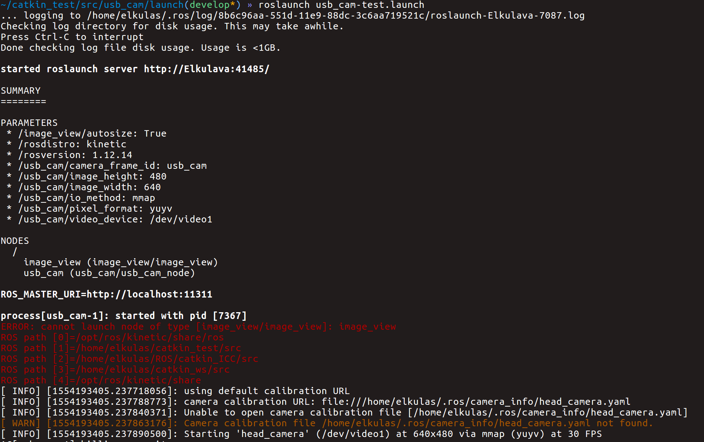
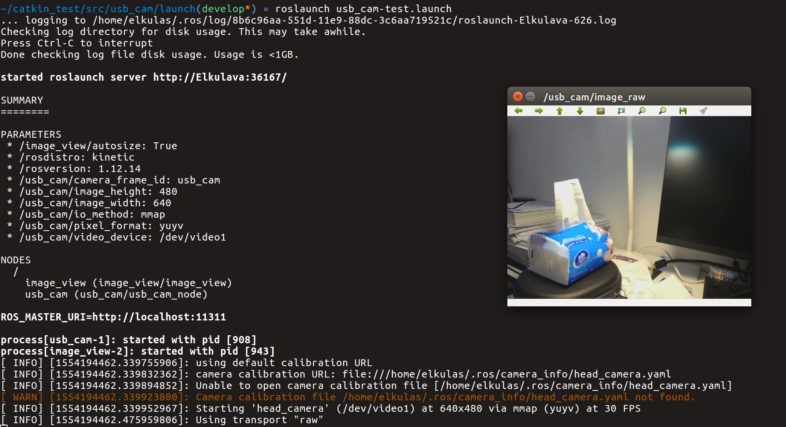

## ROS cannot launch node image_view

在准备使用usb_cam这个ROS包的时候发现以下报错：



在`` catkin_make`` 之后已经进行过 ``source`` 的操作了，所以问题不在于此。

经过上网搜索发现，由于电脑里没有安装 ``image_view`` 这个包所以才会报错。因此只需要将这个包安装到电脑上即可：

```sudo apt-get install ros-kinetic-image-view```

安装完成之后便可以顺利运行。

