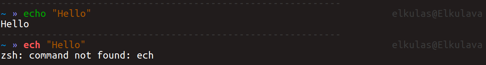
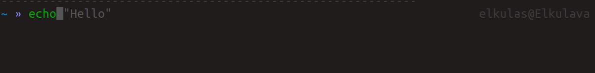

# Plugins for zsh

在安装完毕Oh-My-Zsh之后，是会有随zsh安装的插件（[插件列表](https://github.com/robbyrussell/oh-my-zsh/tree/master/plugins)），这些插件统一存放在`~/.oh-my-zsh/plugins`目录下。 对于我们自己定制的插件，则需要放在 `~/.oh-my-zsh/custom/plugins` 目录下。因此使用zsh插件只需要两步：下载相应的插件至指定插件目录，在 `~/.zshrc` 中将插件进行添加。

## Zsh-syntax-highlighting

[这个插件](https://github.com/zsh-users/zsh-syntax-highlighting) 主要作用是检查每一个命令是否准确。



安装需要执行以下命令

```shell
cd ~/.oh-my-zsh/custom/plugins
git clone https://github.com/zsh-users/zsh-syntax-highlighting
```

完成之后在在 `~/.zshrc` 中将插件进行添加。


## Zsh-autosuggestions

这个插件的主要作用就是将命令进行补全。可以比较方便的进行一些命令行的操作。



安装需要执行以下命令

```shell
cd ~/.oh-my-zsh/custom/plugins
git clone https://github.com/zsh-users/zsh-autosuggestions
```

完成之后在在 `~/.zshrc` 中将插件进行添加。

在添加完成以上两个插件之后 `~/.zshrc` 中情况如下。


对于其他的插件，都可以通过这种方式来进行安装。之后也会进行更新。