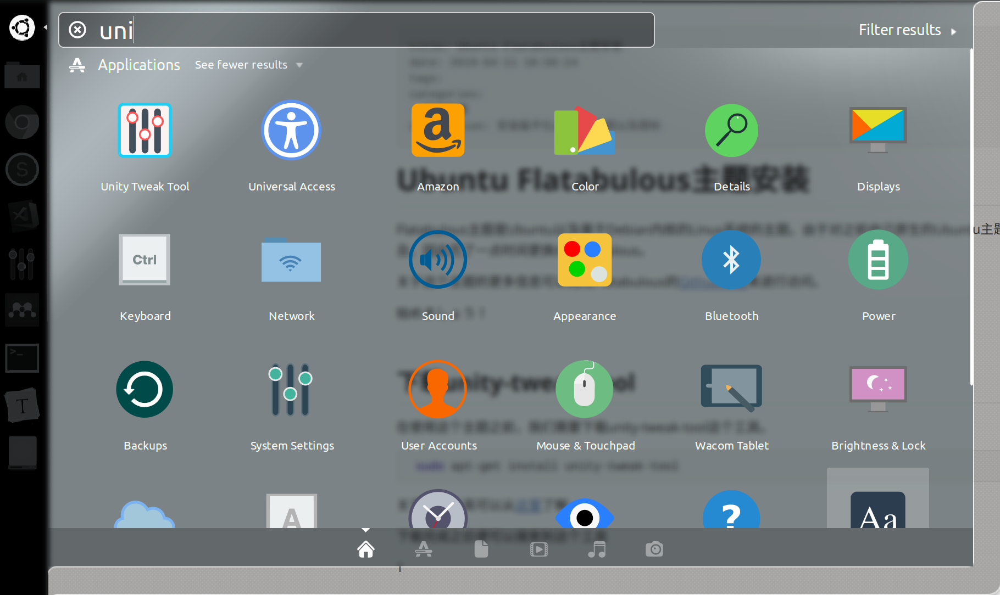
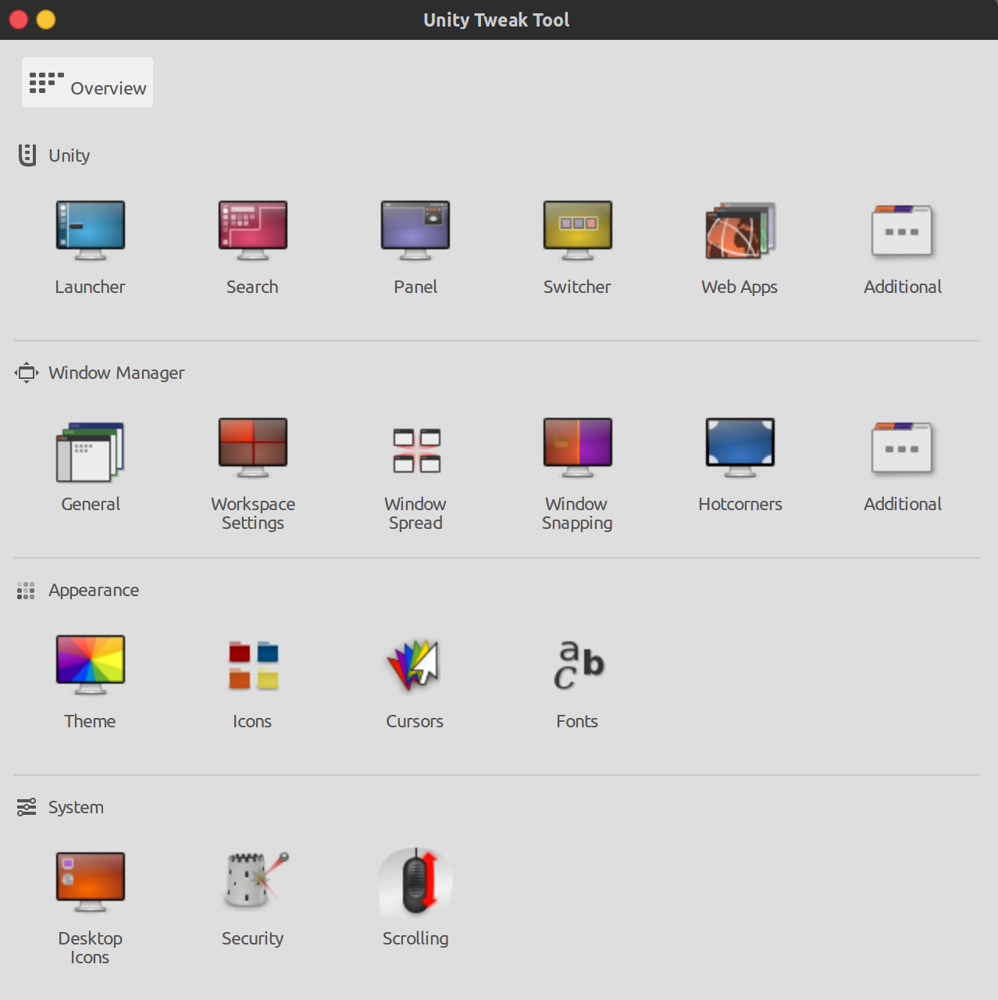
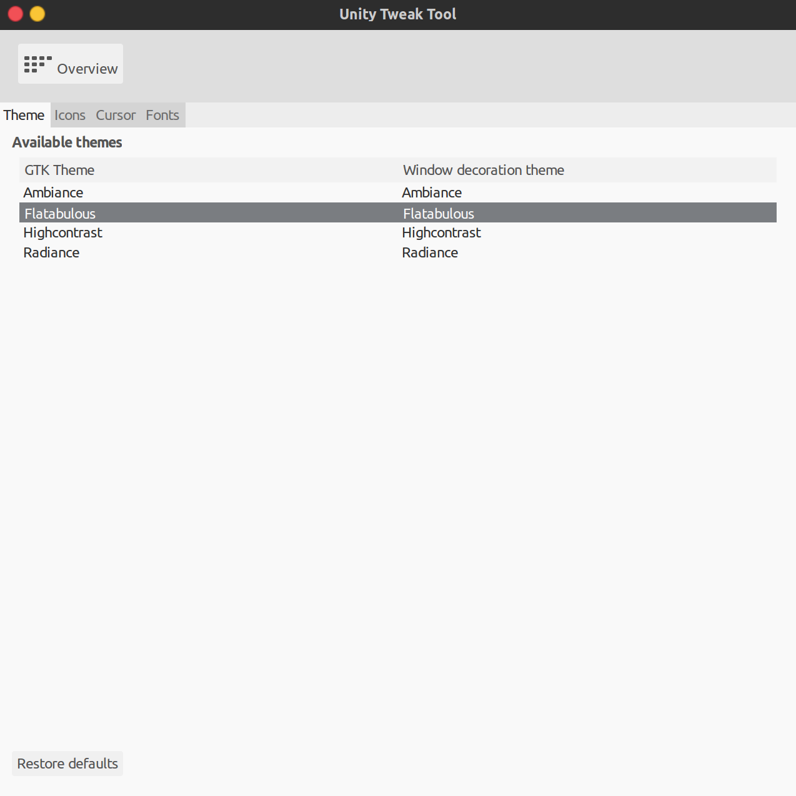
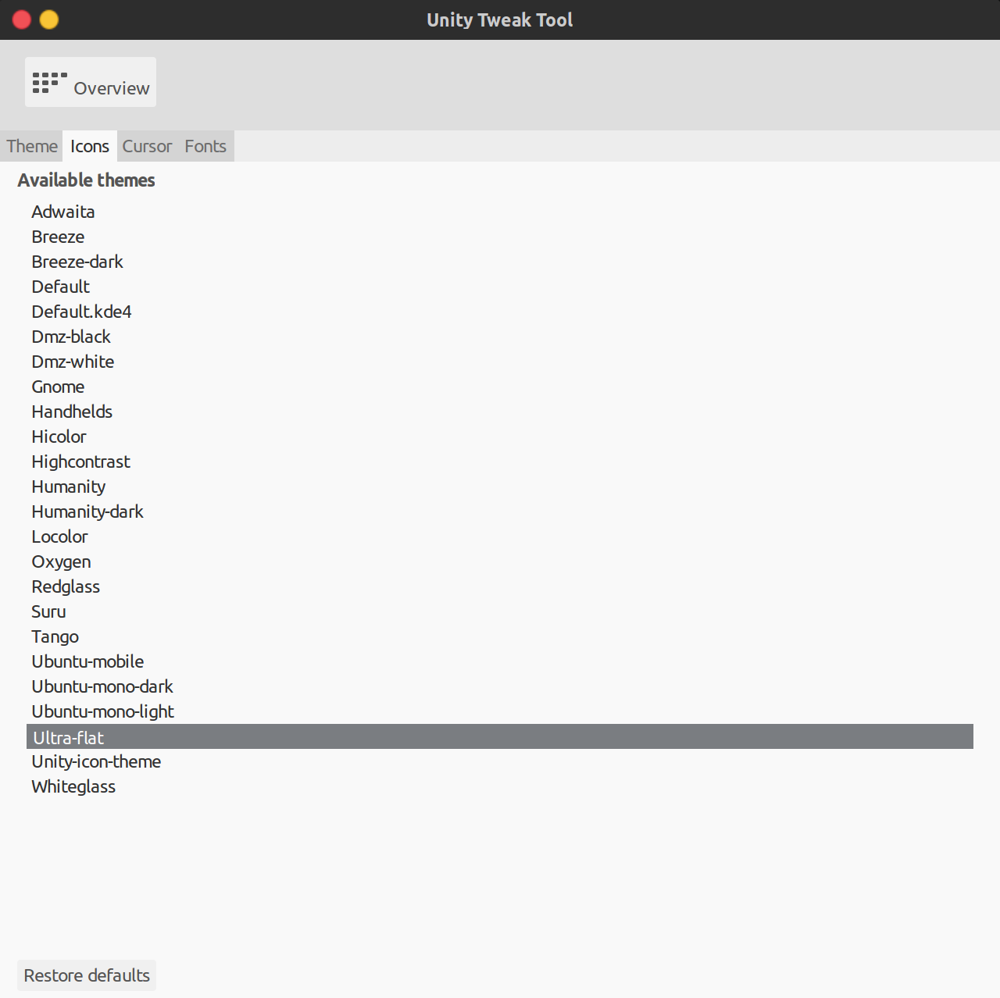

# Ubuntu Flatabulous主题安装

Flatabulous主题是Ubuntu以及基于Debian内核的Linux系统的主题。由于对之前自己原生的Ubuntu主题表示太丑，因此花了一点时间更换成Flatabulous。

关于这个主题的更多信息可以通过Flatabulous的[Github网址](https://github.com/anmoljagetia/Flatabulous)来进行访问。

始めましょう！


## 下载unity-tweak-tool

在使用这个主题之前，我们需要下载unity-tweak-tool这个工具。

```shell
sudo apt-get install unity-tweak-tool
```

关于这个工具可以从[这里](https://launchpad.net/unity-tweak-tool)了解。

下载完成之后便可以搜索到这个工具



点开之后的界面




## 使用noobslab PPA进行Flatabulous下载

```
sudo add-apt-repository ppa:noobslab/themes
sudo apt-get update
sudo apt-get install flatabulous-theme
```

在完成下载之后，点开之前的unity-tweak-tool的界面。在Theme主题下可以找到我们已经下载完毕的主题



## 使用Flat Icons

对于图标，可以使用推荐的Flat Icons（毕竟原来的图标实在是太丑了）运行以下代码

```shell
sudo add-apt-repository ppa:noobslab/icons
sudo apt-get update
sudo apt-get install ultra-flat-icons
```

随后可以在unity-tweak-tool界面中的Icons中进行配置



这样，我们的主题就配置完毕了，这比原来的好看多了。

当然也可以使用这个工具对鼠标以及字体进行调整。


