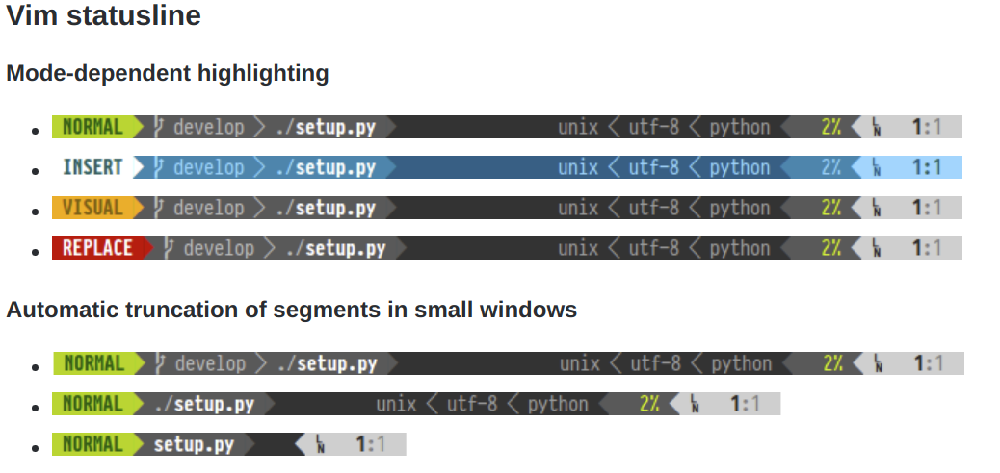
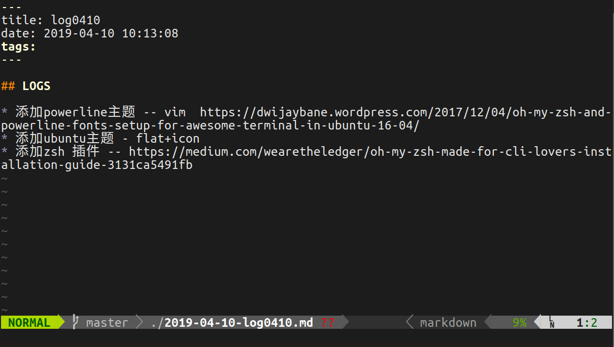

# Powerline for vim

emm原始的vim太丑了最近看上了Powerline 的样式于是就配置一下。主要是眼馋vim下的powerline实在漂亮





所以那就配置吧！

Powerline的[文档](https://powerline.readthedocs.org/en/latest/)，Github项目[地址](https://github.com/powerline/powerline)


## Step 1 下载一些必要工具

 主要是Git, Curl, pip

```powershell
sudo apt-get install git
sudo apt-get install curl
curl --silent --show-error --retry 5 https://bootstrap.pypa.io/get-pip.py | sudo python2.7
```


## Step 2 下载Powerline

```shell
pip install git+git://github.com/Lokaltog/powerline
```


## Step 3 下载Powerline 字体

由于Poweline有这特殊的形式，所以他有他自己的字体库需要下载

首先通过以下命令进行下载

```shell
wget https://github.com/powerline/powerline/raw/develop/font/PowerlineSymbols.otf
wget https://github.com/powerline/powerline/raw/develop/font/10-powerline-symbols.conf
```

然后将其移动到字体的目录下

```
sudo mv PowerlineSymbols.otf /usr/share/fonts/
```

更新系统的字体

```
sudo fc-cache -vf /usr/share/fonts/
```

然后移动之前下载好的字体配置文件

```
sudo mv 10-powerline-symbols.conf /etc/fonts/conf.d/
```


## Step 4 Powerline for vim

完成以上的步骤之后便可以进行vim下的Powerline配置了，其实也比较简单，只要在`~/.vimrc`下添加一下语句便可以实现

```
" Powerline Font Path
set  rtp+=/usr/local/lib/python2.7/dist-packages/powerline/bindings/vim/
set laststatus=2
set t_Co=256
```


之后就大功告成啦！



关于vim其实也有很多可以进行优化的地方，之后自己也会慢慢进行摸索.

恩，现在就给自己挖一个大坑