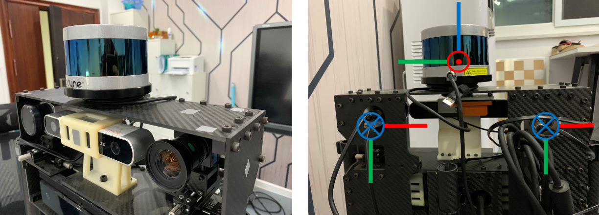
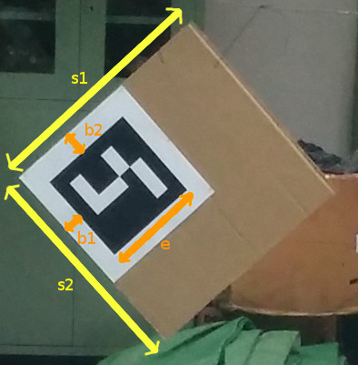

# 相机雷达联合标定

为了实现RGB相机与激光雷达之间的数据融合，需要对相机和雷达进行联合标定。本篇文章所使用的方法主要是2017年Dhall提出的一种开源的标定方法，所进行的操作流程也大致和github中的readme相仿。之后会简单阐述一下怎么进行雷达和相机信息的Overlap.

[Dhall方法链接](https://github.com/ankitdhall/lidar_camera_calibration)

本文所使用的传感器为velodyne公司的vlp-16激光雷达和Imagingsource的工业相机，两者刚性固定。


## 软件环境配置

该方法有以下先备条件：

1. ROS
2. aruco_ros包
3. aruco_mapping包，其中该包需要安装他们更改过的版本，而不是原生版本

### 安装

1. git clone

```shell
git clone git@github.com:ankitdhall/lidar_camera_calibration.git
```

2. 将 `dependencies/aruco_ros` 和 `dependencies/aruco_mapping` 文件夹`path/to/your/ros/workspace/src` 
3. 运行以下代码

```shell
catkin_make -DCATKIN_WHITELIST_PACKAGES="aruco;aruco_ros;aruco_msgs"
catkin_make -DCATKIN_WHITELIST_PACKAGES="aruco_mapping;lidar_camera_calibration"
catkin_make -DCATKIN_WHITELIST_PACKAGES=""
```


## 参数文件配置

对于不同的标定环境，所需要修改的是`conf`文件夹下的一系列参数文件，以及`launch`文件夹下的`.launch`文件


### config_file.txt

```
640 480
-2.5 1.5
-0.3 1.0
0.0 10
0.001
2
0
824.572510 0.0 428.863060 0.0
0.0 831.239746 245.518786 0.0
0.0 0.0 1.0 0.0
100
1.57 -1.57 0.0
```

这里面的内容分别为

```
相机分辨率　宽　长
x- x+
y- y+
z- z+
点云强度的阈值
所使用标定板数目
是否使用camera_info
fx 0 cx 0
0 fy cy 0
0 0 1 0
最大迭代次数
两个传感器之间的初始旋转关系　ｘ y z
```

**相机分辨率**的设置需要和相机内参标定`.ini`文件相匹配。

接下来的`x-` , `x+`, `y-` , `y+`, `z-` , `z+`用来制作一个包围盒，将不需要，即不包含标定板的点进行筛除。该方法所使用到的x,y,z都是以相机坐标系为准的。该方法规定相机和激光雷达的坐标系如下所示。




其中红色代表x轴，绿色代表y轴，蓝色代表z轴。相机坐标系下z轴向前，y轴向下，x轴向右。因此可以通过`x-` , `x+`, `y-` , `y+`, `z-` , `z+`来规划一个包围盒，将所需要的点云进行选取以进行下一步操作。


**点云强度阈值　**这一步是筛选出标定板边缘的点，需要手动进行调整。*该值越大，在之后cloud窗口中的点越少，筛取的能力*

**是否使用camera_info**　１表示使用，０表示不使用。由于camera_info中自己会输出相机的一系列参数，假如选择使用的话，就不需要在后面输入相机的内参参数。若选择不使用，则相机的内参参数是从`config.txt`中导入的。

**最大迭代次数**　表示在之后线拟合的时候进行的最大迭代次数

**初始旋转关系**　表示两个传感器之间的一个初始**旋转**关系，与两者之间的平移关系无关。**此处依旧存在疑问**（link），倘若传感器都是正向放置安装，则使用默认即可


### marker_coordinates.txt

这个文件中放置的的关于标定板的一些信息。关于标定板必须要数据准确，否则会影响到之后的标定结果

```
2
46.1
49
3.0
3.0
23.4
46.4
49
3.0
3.0
23.4
```

制作完毕之后的标定板如下所示



```
所使用标定板数量
s1
s2
b1
b2
e
```

**在这个文件中的单位为厘米cm**


### lidar_camera_calibration

```
lidar_camera_calibration:
  camera_frame_topic: /camera/image_raw
  camera_info_topic: /camera/camera_info
  velodyne_topic: /velodyne_points
```

其中，前面两个是插上的usb相机的topic，后面是点云的topic。在插上传感器之后可以通过`rostopic list` 来查看相应的`topic`。


### find_transform.launch

由于使用该方法来进行标定工作的时候，需要aruco标识的检测工作，所以在启动标定的launch文件之前需要启动aruco相关的节点。因此在`.launch`文件中需要修改关于aruco相关的参数。

```xml
<?xml version="1.0"?>
<launch>
  <param name="/use_sim_time" value="true"/>

  <!-- ArUco mapping -->
  <node pkg="aruco_mapping" type="aruco_mapping" name="aruco_mapping" output="screen">
    <remap from="/image_raw" to="/camera/image_raw"/>

    <param name="calibration_file" type="string" value="$(find aruco_mapping)/data/tiscam.ini" /> 
    <param name="num_of_markers" type="int" value="2" />
    <param name="marker_size" type="double" value="0.234"/>
    <param name="space_type" type="string" value="plane" />
    <param name="roi_allowed" type="bool" value="false" />
  </node>

  <rosparam command="load" file="$(find lidar_camera_calibration)/conf/lidar_camera_calibration.yaml" />
  <node pkg="lidar_camera_calibration" type="find_transform" name="find_transform" output="screen">
  </node>
</launch>
```

1. 倘若插着两个传感器直接进行标定工作，在`.launch`文件中需要把`<param name="/use_sim_time" value="true"/>`给注释掉，但是**建议**使用`rosbag`录制数据之后进行标定工作。
2. 注意相机内参标定文件`.ini`需要放到`aruco_mapping`包下中的正确位置
3. 修改`num_of_markers`
4. 修改`marker size`


