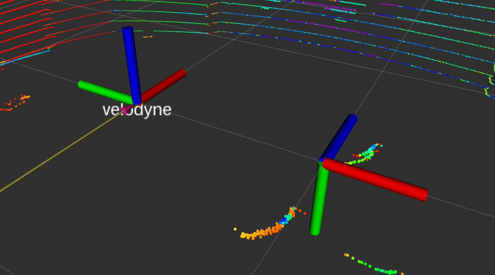
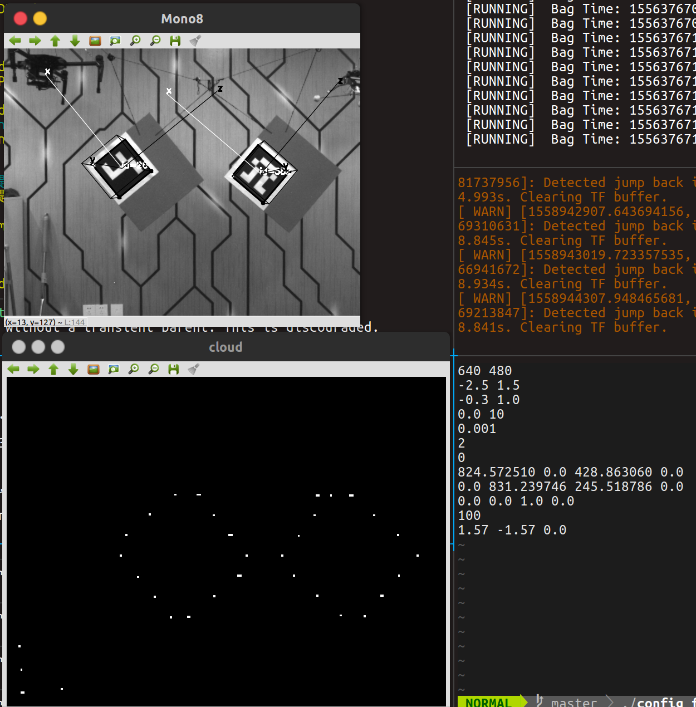
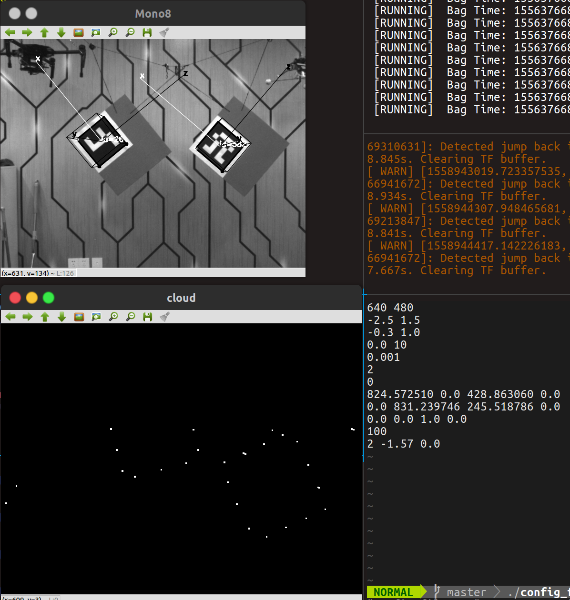
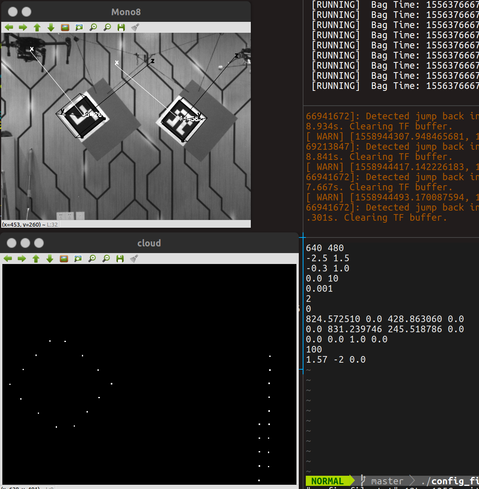

#　初始旋转关系疑问

初始旋转关系主要是将激光雷达坐标系转变到相机坐标系下。按照作者说法，当两个传感器正向放置的时候，便可以使用`1.57 -1.57 0.0`作为初始旋转关系。然而如果按照xyz旋转方式，即rpy的话是无法变换得到相机坐标系的。

然而使用提供的初始角度之后可以得到激光雷达点云在相机平面内的正确投影如下图所示

可以发现在相机视野范围内可以有尺度一致的点云图，也就是说两者很好的初始化了。但是按照之前所述，初始化是为了从激光雷达到相机平面上的变换的话，应该是ｘ上-1.57，再ｙ上1.57，ｚ不变，按照这种形式才能从左边的激光雷达坐标系转移到右边的相机坐标系。但这样是错误的。

可以对这三个值进行调整来看他们到底是怎么影响的。

#### 改x

`2 -1.57 0.0`

可以发现，相比于标准的图像，将ｘ变大之后row确实变大，点云变换偏右旋转

#### 改y

`1.57 -2 0.0`

可以发现，相比于标准的图像，将y变小之后yaw确实变化，点云整体向右边偏。

2019.5.27提出，希望自己之后解决。

••••••