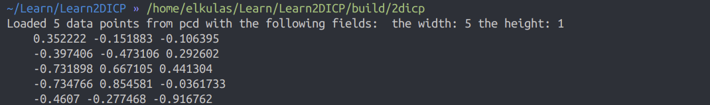
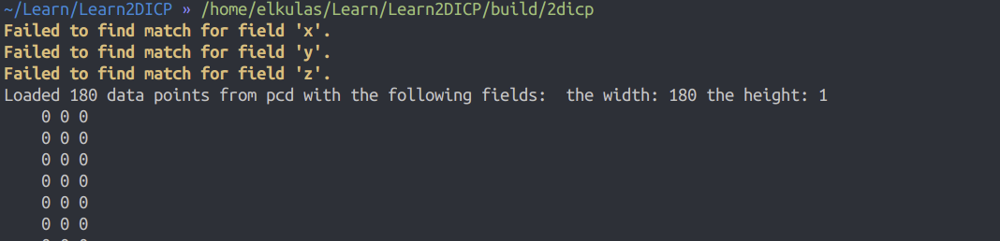
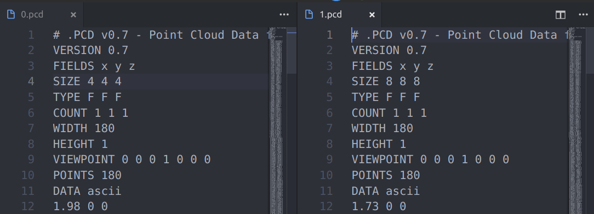

# PLY to PCD

做一个小作业老师给的是ply文件，但由于使用pcl库里面用的比较多的还是pcd的格式。在搜了很多次之后还是使用官方提供的工具来进行转换，在[这个链接](https://github.com/PointCloudLibrary/pcl/tree/master/tools)里，pcl官方提供了很多有用的工具，在这里我们使用ply2pcd.cpp。

编译之后运行这个文件，用以下的格式来进行运行：

```shell
./ply2pcd [-format 0|1] input.ply output.pcd
```

其中，format代表了输出的格式，0代表ascii，1代表binary.

通过这种方式比那可以实现转换。

## 读取点云的小问题

在之后还出现了一个小问题，就是，在使用官方的例程的时候，是可以进行pcd文件点云的写入的：




但是一旦使用自己的pcd文件之后就会出现这样的报错，并且所有的数据都是0：




通过google之后，找到了[这篇issue](https://github.com/PointCloudLibrary/pcl/issues/1953)，这里提到了，有时候点云的精度格式会影响到其读取与写入，也就是double和float之间的区别：



于是，只要把原文件中的size改成4 4 4 便可以成功进行读取了。

