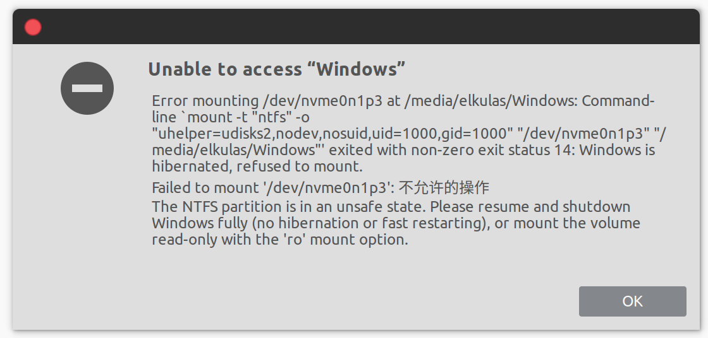

# Windows hibernated in ubuntu

因为自己在windows下的mendeley desktop出现了一些玄学问题，所以最近在家一直都是使用Ubuntu下的Mendeley进行文献阅读。自己之前给ubuntu分配了较少的容量，所以文献都是存在windows中。然而今天打开之后发现，挂载的windows突然打不开了

明明之前都是好用的为啥突然出现了这个情况？于是就去查阅了一些[资料](https://wiki.manjaro.org/How_to_mount_Windows_(NTFS)_filesystem_due_to_hibernation)，才知道，这说明自己在使用ubuntu的时候，windows正在休眠。于是就想起来昨天晚上挂着windows然后电脑没电关机，所以可能是这个原因。

重启之后进入windows，果真是昨晚的画面与程序，关掉windows进入ubuntu，挂载的windows便又可以重新进入了。

