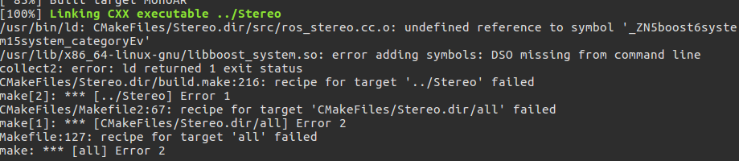

最近在按照ORBSLAM2官方给的教程来编译其ROS节点，但是在编译的过程中出现了一点小问题，在这里稍稍记录一下。

问题如下图所示




这里连接器ld报错，说在加symbol的时候没有找到。也就是说linking过程中这个symbol还是处于relocated的状态。所以解决这个问题也比较简单，就单独把这个动态库链接上executable object就行了。如果使用命令行的话就加两个参数就行。因为我们使用的是cmake，所以需要在CMakeLists里面添加动态库.so的链接，并且在LIBS中进行添加。

```cmake
# 因为编译双目和rgbd出现问题所以需要另外手动添加libboost中的库
set( LIB_BOOST_SYSTEM_DIR /usr/lib/x86_64-linux-gnu)
add_library(libboost_system SHARED IMPORTED)
set_target_properties(libboost_system PROPERTIES IMPORTED_LOCATION 
    ${LIB_BOOST_SYSTEM_DIR}/libboost_system.so)


set(LIBS 
libboost_system
${OpenCV_LIBS} 
${EIGEN3_LIBS}
${Pangolin_LIBRARIES}
${PROJECT_SOURCE_DIR}/../../../Thirdparty/DBoW2/lib/libDBoW2.so
${PROJECT_SOURCE_DIR}/../../../Thirdparty/g2o/lib/libg2o.so
${PROJECT_SOURCE_DIR}/../../../lib/libORB_SLAM2.so
)

```

之后编译通过，成功。


事实证明，最近看的CMU15213课程没白看= =，还是很有用的