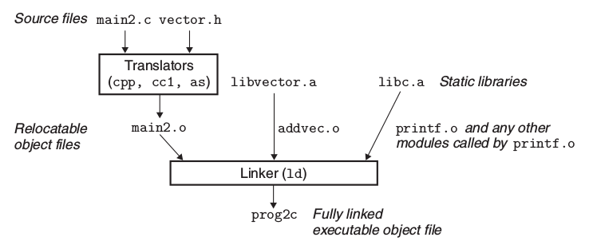

# 动态链接与静态链接

在大概半年之前把，当时一直在搞ORBSLAM的源代码，然而却遇到了很多关于编译上的问题。当时的自己因为什么都不懂所以一股脑儿就在csdn或者stackoverflow上面去找各种各样的solution，看到有相符的也就想都不想直接复制命令行，然后在自己的电脑上进行操作。以至于，我现在自己笔记本电脑上的环境已经是乱七八糟了。

当时导师一对一谈话的时候，我就和老师说我自己因为不是科班出身所以对于这种编译的过程不是特别了解，需要进一步的学习。但是自己当时也就是在网上看了一点关于链接库的博客，并没有很系统的去学习。

直到今年春天，现在在CMU的曹大哥给我推荐了他现在正在上的一门课程之后，我觉得我相比之前走进了一大步。

因为看到了Linking的部分，所以在此简单记录一下，就相当于向以前的自己交上一份答卷吧。


## 静态链接

加入没有使用库文件的话，那么将所有的.o文件链接起来的方式便是一个一个将他们写出来，也就是：

```bash
gcc main.c /usr/lib/printf.o /usr/lib/scanf.o . . .
```

这确实是一种有效的链接方式，通过这种方式可以完成对main.o中的relocatable的部分进行relocate。但是一旦文件多的话这种方式就会变得很繁琐。因此在进行实际LInking过程中，可以将需要链接的部分整理到一个库中，这也就是我们所说的静态链接库。

静态链接库在linux-x64下本质上是一种压缩包，所以后缀都是.a。文件执行静态链接的过程如下所示：



从这张图可以清楚的看到，即使所有的.o文件都在.a库中，但是Linker可以做到从静态库中找到main.o所reference的symbol，并将其链接。因此这是一种比较方便的方法对文件进行链接。

### 对symbol的解引用(Resolve Reference)

在没有进行链接的main.o文件中，因为调用了非自身module的一些变量或者函数，因此会存在一个包含这些变量以及函数的symbol table，来告诉之后的Linker，他需要在之后的文件中找到这些symbol的declare place。

那么Linker会怎么做这一步？首先他会对源文件生成的.o文件进行一次扫描，并产生三个参数集合：E，U，D：

* E：包含之后会合并到可执行文件中的所有relocatable object files
* U：还没有解析的symbols（那些引用到的但没有被定义的 referred but not defined）
* D：在之前文件中已经定义完毕的symbols

在最开始进入到Linker的时候，这三个集合都是空集合。

* 对于每一个在指令行中涉及的文件，首先Linker先判断这是一个.o文件还是一个.a库文件
* 如果是一个.o文件，那么Linker在解析.o文件中的各个部分(.data .text symbol table等等)之后，将文件放入集合E，并同时对U和D进行更新，找到.o文件中定义过或者未定义的symbols
* 如果是一个.a文件，那么Linker会到静态库中去寻找和集合U中symbol一致的定义部分。找到了也就是说，源文件在引用这个symbol的时候是可以找到定义的。那些找到的symbol 的定义文件.o文件，经过这一步之后就会放入到集合E中，同时更新UD两个集合。对于一个.a文件，Linker几乎会遍历所有所涉及的symbols，直到最后UD两个集合不变为止。之后，库文件中没有在E中的文件就会被丢弃不用，然后Linker会去看下一个文件。
* 在Linker完成了所有文件的扫描之后，假如集合U非空，那么就会产生错误。如果集合U是空集，那么LInker就会整合集合E中的所有文件，然后生成可执行的文件。

通过以上的步骤可以清晰的发现，在对于静态库的链接过程中，链接库的顺序也是十分重要的。有时候交换顺序就会出现问题。

在完成了静态库的链接之后，Linker要做的就是relocation了～


## 动态链接库

静态链接库虽然比较方便，但是有一点比较麻烦，就是静态链接库太笨重了。一旦有一点改动，则需要对整个库进行重新编译。同时，如果有多个进程重复引用同一个函数的话，也存在重复load静态库的笨重操作，并且很吃内存。

因此，便出现了动态链接库。

动态库之所以厉害，主要是他可以在任何时候介入链接，而不像静态库一样只有一种笨重的连接方式。动态库可以可以在程序load进memory时候链接，也可以在运行的时候进链接。具体链接的示意图如下所示


相比于静态链接，动态链接做的比较巧。

最基本的理念就是，在可执行文件生成的时候使用静态链接的手段，在load的过程中完成所有的linking的工作。在第一步Linker进行链接的时候，其实code和data这两块并没有copy进去（也就是最占内存的两块），而真正进行操作的其实是relocation的信息和symbol table的信息。在有了这两部分的信息之后，在load的时候就可以从动态库中调用data和code这两部分了。、

在进入loader之后，可执行程序还会调用一个动态Linker来完成剩下的连接工作。这个动态Linker也就是图中所述的ld-linux.so，自己本身也是一个动态链接库。该动态Linker会做以下的relocation来使code和data运作

* 将之前涉及的动态库.so中的data和text分别relocating到正确的内存地址中
* 将部分链接可执行文件中所涉及的symbols的定义也进行relocate

也就是说，在load之前，静态链接Linker已经为整个可执行文件在内存中搭好了框架，而动态链接的过程就是在框架上填入程序所需要的部分。


