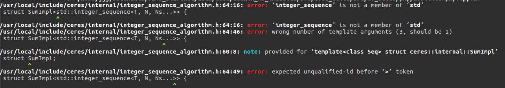

今天在编译一个imu标定的库的时候发现，编译过程中总是出现 XXX is not a member of ‘std’ 的错误



可以发现错误出现的位置是在ceres库中。因为自己的ceres环境用的是2.0.0版本，其中使用了C++14 的标准进行编译，而该ros包使用的是c++11的标准，所以会出现标准库错误的情况。

因此，为解决该问题，在该ros包中的CMakeLists中将c++标准改成C++14即可

```cmake
set(CMAKE_CXX_STANDARD 14)
set(CMAKE_CXX_STANDARD_REQUIRED ON)

set(CMAKE_BUILD_TYPE "Release")
set(CMAKE_CXX_FLAGS "-std=c++14")
set(CMAKE_CXX_FLAGS_RELEASE "-O3 -Wall -g -fPIC -fopenmp")
```

