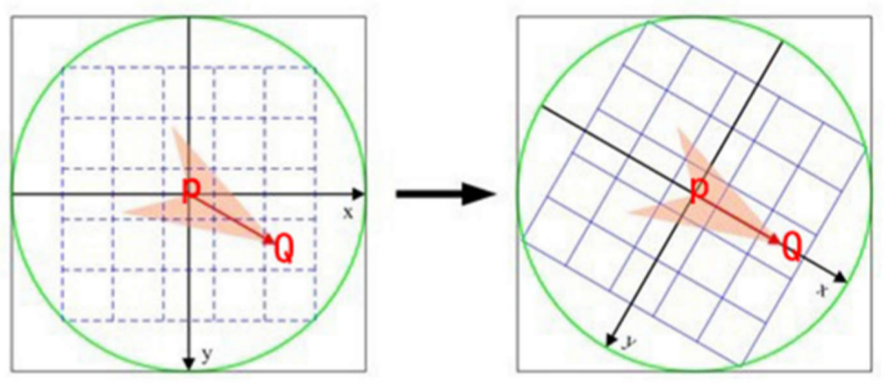
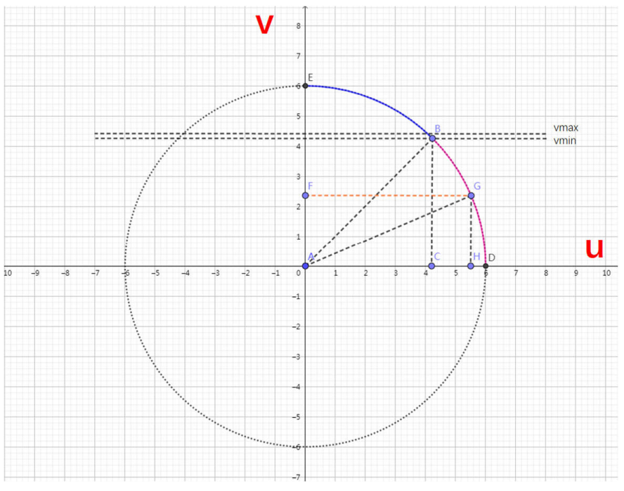
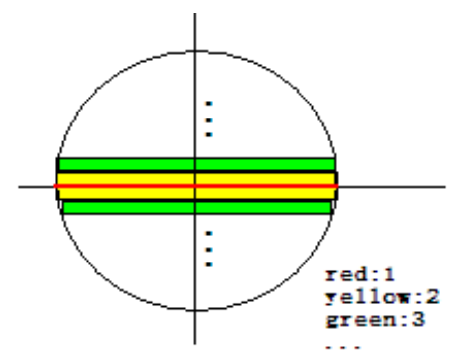

# Oriented Fast 的高效实现

在通过金字塔以及均匀化操作之后得到FAST点之后，需要对FAST得到的Keypoints附加上angle的特性，这一部分主要是在`ORBextractor.cc`文件中的`computeOrientation`函数来实现，可以发现这个函数的reference全是在提取特征点函数`ORBextractor::ComputeKeyPointsOctTree`以及`ORBextractor::ComputeKeyPointsOld`中的最后一行出现。


这个函数最重要的部分就是遍历所有提取得到的特征点，并附加上angle，起到作用的函数便是`IC_Angle`函数


## 灰度质心法

其实就是计算一个**圆**内质心和形心的角度

相比于在高博那边给出的计算ORB的例子，ORBSLAM2中使用的方法是采用一个圆而不是正方形，这样保证旋转的一致，而不会存在一部分位置旋转后找不到这样的情况（用正方形就会这样）



这里图上P就是形心，Q就是质心所要计算的部分就是这个角度

###　计算方法

计算公式如下
$$
c_x = \frac{\overbrace{\sum_{x=-R}^{R} \sum_{y=-R}^{R} x I_{(x, y)}}^{m_{10}}}{\underbrace{\sum_{x=-R}^{R} \sum_{y=-R}^{R} I_{(x, y)}}_{m_{00}}}
$$

$$
c_y = \frac{\overbrace{\sum_{x=-R}^{R} \sum_{y=-R}^{R} y I_{(x, y)}}^{m_{01}}}{\underbrace{\sum_{x=-R}^{R} \sum_{y=-R}^{R} I_{(x, y)}}_{m_{00}}}
$$

最后计算角度
$$
\theta=\arctan 2\left(c_{y}, c_{x}\right)=\arctan 2\left(m_{01}, m_{10}\right)
$$
其中m10便是图像灰度值乘上ｘ轴上的对应值，同理m01就是图像灰度值乘上ｙ方向上值


所以整体上想法其实很简单，麻烦就麻烦在选取圆上的点，以及orb使用一种高效的计算方式来计算angle


## umax的含义

可以发现在函数IC_Angle的传入参数中还有一个参数是`umax`,类型是`vector<int>`

```c++
static float IC_Angle(const Mat& image, Point2f pt,  const vector<int> & u_max)
```

前面两个参数是图像Mat以及具体的特征点的位置，也就是之前说的形心

`umax`是ORBextractor类中的一个成员变量，在`ORBextractor::ORBextractor`构造函数中便已经进行赋值



主要的思路就是，**移动y轴上的v的值，来通过勾股定理计算每一个v所对应的umax**。先计算八分之一圆，再补足成为四分之一圆，这也是构造函数最后部分做的工作

```c++
	// 利用圆的方程来计算每行像素的u的坐标边界，也就是八分之一圆周上点的x坐标的边界
    // 本质上就是勾股定理，这里算出来是八分之一圆
    for (v = 0; v <= vmax; ++v)
        umax[v] = cvRound(sqrt(hp2 - v * v));

    // Make sure we are symmetric
    // 倒过来算，算上半个八分之一圆，从y方向最大到中间
    // 做完四分之一圆之后剩下的部分可以直接镜像操作
    for (v = HALF_PATCH_SIZE, v0 = 0; v >= vmin; --v)
    {
        while (umax[v0] == umax[v0 + 1])
            ++v0;
        umax[v] = v0;
        ++v0;
    }
```

在构造函数完毕之后，**umax这个容器里面就存放了不同v下所对应的umax值**，也就是说可以使用v和umax来找到圆周上的点的坐标。


## IC_Angle加速计算角度

了解umax之后返回到IC_Angle函数

这里的具体操作可以如下图所示：



其中，红线部分就是作者认定的最长边

所以作者在操作计算的过程中直接把红线部分单独提出来做的计算，也就是v=0的情况

```c++
	// Treat the center line differently, v=0
    // 对中心线特殊对待，也就是v = 0的行
    for (int u = -HALF_PATCH_SIZE; u <= HALF_PATCH_SIZE; ++u)
        
        // 此处center的下标可以为负数，中心水平线上的像素按照x方向进行加权
        m_10 += u * center[u];
```

而后就是最简洁的部分，也就是如何去加速进行计算m10和m01两个变量

普通的方式便先遍历所有x轴计算得到m10，然后遍历所有y轴得到m01

但是这里所使用的方式就很巧妙，他抓住了一个点，便是这整个圆是symmetric的，所以可以通过四分之一圆来进行简单的操作，来实现一次遍历便计算出m10和m01

总的大循环便是在v方向上，圆的上半部分v是正的，v的下半部分v是负的；然后同样从中间出发，向左右两边遍历具体的像素值，然后进行累加操作。

使用这种方法可以快速高效的计算出角度

```c++
    // 以v=0中心线作为对称轴，然后对称的在成对的上下两行中进行遍历，
    // 通过这种方式从一个四分之一圆扩展到整个圆
    for (int v = 1; v <= HALF_PATCH_SIZE; ++v)
    {
        // Proceed over the two lines
        int v_sum = 0;

        // 获取该行最大的像素横坐标范围
        // 也就是四分之一圆上的范围
        int d = u_max[v];

        // 横坐标进行遍历操作，本质上一次遍历两个，也就是一上一下
        // 每次遍历的两个点坐标，中心点上就是(x,y)，中心点下就是(x,-y)
        // 对于某次待处理的两个点：m_10 = Σ x*I(x,y) =  x*I(x,y) + x*I(x,-y) = x*(I(x,y) + I(x,-y))
        // 对于某次待处理的两个点：m_01 = Σ y*I(x,y) =  y*I(x,y) - y*I(x,-y) = y*(I(x,y) - I(x,-y))
        // 这里其实就是-y
        for (int u = -d; u <= d; ++u)
        {
            // 得到需要进行加运算和减运算的具体像素灰度值
            // 本质上就是u，v所对应的图像坐标上的灰度值
            // val_plus: 在中心线上方x=u时候的像素灰度值
            // val_minus: 在中心线下方x=u时候的像素灰度值
            int val_plus = center[u + v*step], val_minus = center[u - v*step];
            // m01
            v_sum += (val_plus - val_minus);
            // m10
            m_10 += u * (val_plus + val_minus);
        }
        // 将这一行上的像素值进行y坐标加权
        m_01 += v * v_sum;
    }

    return fastAtan2((float)m_01, (float)m_10);
```


