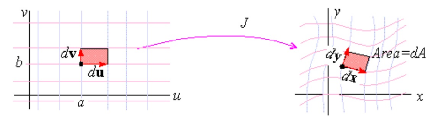

## 简单阐述

设 ![[公式]](https://www.zhihu.com/equation?tex=f+%3A+%5Cmathbb%7BR%7D_n+%5Cto%5Cmathbb%7BR%7D_m) 是一个函数，它的输入是向量 ![[公式]](https://www.zhihu.com/equation?tex=%5Cmathbf+x+%5Cin%5Cmathbb%7BR%7D_n) ，输出是向量 ![[公式]](https://www.zhihu.com/equation?tex=%5Cmathbf+y%3Df%28%5Cmathbf+x%29%5Cin%5Cmathbb%7BR%7D_m) :
$$
\left\{\begin{array}{l}
y_{1}=f_{1}\left(x_{1}, \ldots, x_{n}\right) \\
y_{2}=f_{2}\left(x_{1}, \ldots, x_{n}\right) \\
\cdots \\
y_{m}=f_{m}\left(x_{1}, \ldots, x_{n}\right)
\end{array}\right.
$$
那么雅克比矩阵就是一个 m x n 的矩阵:
$$
\mathbf{J}=\left[\begin{array}{ccc}
\frac{\partial \mathbf{f}}{\partial x_{1}} & \cdots & \frac{\partial \mathbf{f}}{\partial x_{n}}
\end{array}\right]=\left[\begin{array}{ccc}
\frac{\partial f_{1}}{\partial x_{1}} & \cdots & \frac{\partial f_{1}}{\partial x_{n}} \\
\vdots & \ddots & \vdots \\
\frac{\partial f_{m}}{\partial x_{1}} & \cdots & \frac{\partial f_{m}}{\partial x_{n}}
\end{array}\right]
$$
**由于矩阵描述了向量空间中的运动——变换，而雅可比矩阵看作**是将点 ![[公式]](https://www.zhihu.com/equation?tex=%28x_1%2C%5Cdots%2Cx_n%29) 转化到点 ![[公式]](https://www.zhihu.com/equation?tex=%28y_1%2C%5Cdots%2Cy_m%29) ，或者说是从一个n维的欧式空间转换到m维的欧氏空间。

也就是说雅克比矩阵就是表述了两组不同维变量之间的变换

如果m = n， 可以定义雅可比矩阵 ![[公式]](https://www.zhihu.com/equation?tex=%5Cmathbf%7BJ%7D) 的行列式，也就是**雅可比行列式（Jacobian determinant）**

**在微积分换元中，也就是给出了 从x到y的n维体积的比率**
$$
\mathrm{dy}_{1} \ldots \mathrm{dy}_{\mathrm{n}}=|\mathrm{J}| \mathrm{d} \mathrm{x}_{1} \ldots \mathrm{d} \mathrm{x}_{\mathrm{n}}
$$

## 几何解释

### 雅克比行列式

这里用二元的情况来阐述一下雅克比行列式的情况

设 ![[公式]](https://www.zhihu.com/equation?tex=x%3Dx%28u%2Cv%29%2C%5Cquad+y%3Dy%28u%2Cv%29) ，雅可比行列式是：
$$
\mathbf{J}=\left|\frac{\partial(x, y)}{\partial(u, v)}\right|=\left|\begin{array}{ll}
x_{u} & x_{v} \\
y_{u} & y_{v}
\end{array}\right|
$$

如图所示：dA代表dx和dy张成的平行四边形的面积，如果du和dv充分接近于0，那么dA：
$$
d A=d x d y=\left|\frac{\partial(x, y)}{\partial(u, v)}\right| d u d v
$$

### 雅克比矩阵

关于雅克比矩阵的几何意义，[这篇视频教程](https://www.khanacademy.org/math/multivariable-calculus/multivariable-derivatives/jacobian/v/computing-a-jacobian-matrix)讲的很清楚

