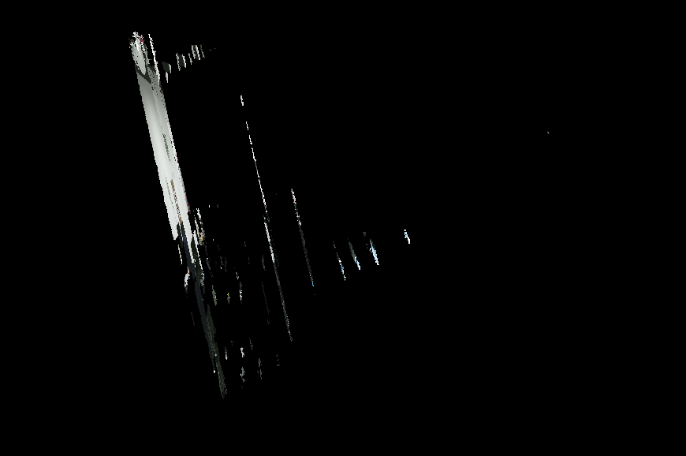
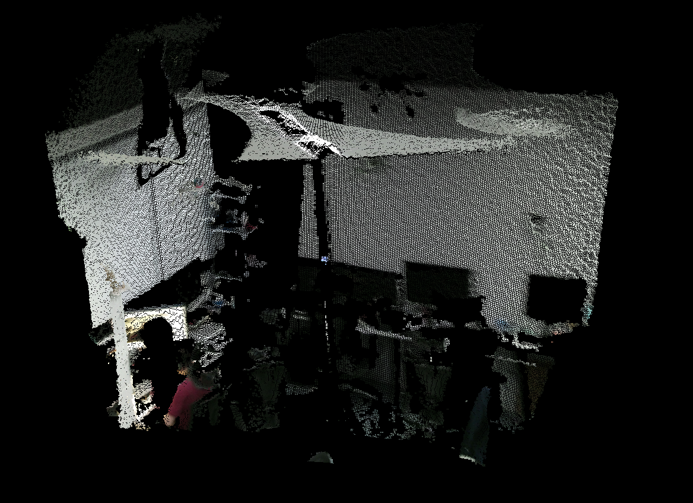

# OpenCV矩阵元素类型

## 深度图上遇到的问题与解决

目前在处理深度图中遇到了一个小问题,因为所提供得到的深度图和RGB图是对应的,所以可以直接读取16位的深度图来生成带有RGB信息的点云.然而按照最简单的方式进行读取之后,所得到的点云是一个片状的情况.

可以发现深度是割裂的,并没有出现连续的深度情况,所以可能是在读取的时候出现了截断.然而在实际检查过程中发现,并不是代码读取部分的问题,而是图片数据源上的问题.所以直接输出depth的一个type来看如下

可以发现,我自己现在获得的depth的一个格式是int 16, 也就是CV8UC3,然而正常的十六位位图应当是CV6UC1, 而后向同学要了一份新的数据之后就可以发现,生成的点云就是连续的,因为这时候获得的深度图的信息就是CV6UC1. 

## CV::Mat类中的type()函数

这里再补充一下关于OPenCV中的一些数据类型的内容

在使用OPenCV时,一下两个情况是必须知道矩阵元素的数据类型的:

1. 使用 at 的方式访问数据元素的时候需要指出数据类型
2. 做数值运算的时候,比如究竟是整数除法还是浮点数除法。

所以需要使用CV::Mat中的type()函数来确定此时的Mat中的数据类型是什么.

因为返回值是int,所以返回值和实际类型有以下的对应关系:

|        | C1   | C2   | C3   | C4   |
| :----: | ---- | ---- | ---- | ---- |
| CV_8U  | 0    | 8    | 16   | 24   |
| CV_8S  | 1    | 9    | 17   | 25   |
| CV_16U | 2    | 10   | 18   | 26   |
| CV_16S | 3    | 11   | 19   | 27   |
| CV_32S | 4    | 12   | 20   | 28   |
| CV_32F | 5    | 13   | 21   | 29   |
| CV_64F | 6    | 14   | 22   | 30   |

第四个通道也就是C4表示透明度

可以通过以下的方式来对不同通道进行访问

|        | C1       | C2          | C3          | C4          | C6          |
| ------ | -------- | ----------- | ----------- | ----------- | ----------- |
| uchar  | `uchar`  | `cv::Vec2b` | `cv::Vec3b` | `cv::Vec4b` |             |
| short  | `short`  | `cv::Vec2s` | `cv::Vec3s` | `cv::Vec4s` |             |
| int    | `int`    | `cv::Vec2i` | `cv::Vec3i` | `cv::Vec4i` |             |
| float  | `float`  | `cv::Vec2f` | `cv::Vec3f` | `cv::Vec4f` | `cv::Vec6f` |
| double | `double` | `cv::Vec2d` | `cv::Vec3d` | `cv::Vec4d` | `cv::Vec6d` |

##### 数据类型及其取值范围

| 数值   | 具体类型        | 取值范围                          |
| ------ | --------------- | --------------------------------- |
| CV_8U  | 8 位无符号整数  | （0…..255）                       |
| CV_8S  | 8 位符号整数    | （-128…..127）                    |
| CV_16U | 16 位无符号整数 | （0……65535）                      |
| CV_16S | 16 位符号整数   | （-32768…..32767）                |
| CV_32S | 32 位符号整数   | （-2147483648……2147483647）       |
| CV_32F | 32 位浮点数     | （-FLT_MAX ………FLT_MAX，INF，NAN)  |
| CV_64F | 64 位浮点数     | （-DBL_MAX ……….DBL_MAX，INF，NAN) |

