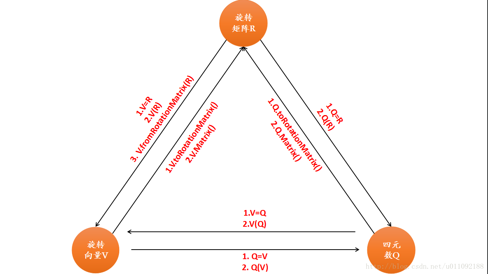

主要是参考[这个教程](https://blog.csdn.net/u011092188/article/details/77430988)

## Eigen中各种形式的表示

```c++
旋转矩阵（3X3）:Eigen::Matrix3d
旋转向量（3X1）:Eigen::AngleAxisd
四元数（4X1）:Eigen::Quaterniond
平移向量（3X1）:Eigen::Vector3d
变换矩阵（4X4）:Eigen::Isometry3d
```

其中因为变换矩阵是一种欧式变换,所以可以使用等距矩阵Isometry来进行表示.若是一般的情况就是使用Affine3d也就是仿射矩阵也是可以的.

## 旋转向量（轴角）赋值

### 旋转的角度和旋转轴向量->初始化角轴

该旋转轴向量是一个单位向量

```c++
AngleAxisd V1(M_PI / 4, Vector3d(0, 0, 1));//以（0,0,1）为旋转轴，旋转45度
```


### 旋转矩阵->旋转向量

#### 使用旋转向量的fromRotationMatrix()函数来对旋转向量赋值

注意此方法为旋转向量独有,四元数没有

```c++
AngleAxisd V2;
V2.fromRotationMatrix(t_R);
```

#### 直接使用旋转矩阵来对旋转向量赋值

```c++
AngleAxisd V3;
V3 = t_R;
```

#### 使用旋转矩阵来对旋转向量进行初始化

```c++
AngleAxisd V4(t_R);	
```


### 四元数->旋转向量

#### 直接使用四元数来对旋转向量赋值

```c++
AngleAxisd V5;
V5 = t_Q;
```

#### 使用四元数来对旋转向量进行初始化

```c++
AngleAxisd V6(t_Q);
```


## 四元数赋值

Eigen库中的四元数前三维是虚部,最后一维是实部

### 旋转的角度和旋转轴向量初始化四元数

使用q=[cos(A/2),n_x\*sin(A/2),n_y\*sin(A/2),n_z\*sin(A/2)]

```c++
Quaterniond Q1(cos((M_PI / 4) / 2), 0 * sin((M_PI / 4) / 2), 0 * sin((M_PI / 4) / 2), 1 * sin((M_PI / 4) / 2));//以（0,0,1）为旋转轴，旋转45度
```

1. 第一种输出四元数的方式

```c++
cout << "Quaternion1" << endl << Q1.coeffs() << endl;
```

2. 第二种输出四元数的方式

```c++
cout << Q1.x() << endl << endl;
cout << Q1.y() << endl << endl;
cout << Q1.z() << endl << endl;
cout << Q1.w() << endl << endl;
```

### 旋转矩阵->四元数

#### 直接使用旋转矩阵来对旋转向量赋值

```c++
Quaterniond Q2;
Q2 = t_R;
```

#### 旋转矩阵来对四元数进行初始化

```c++
Quaterniond Q3(t_R);
```

### 旋转向量->四元数

#### 直接使用旋转向量对四元数来赋值

```c++
Quaterniond Q4;
Q4 = t_V;
```

#### 使用旋转向量来对四元数进行初始化

```c++
Quaterniond Q5(t_V);
```


## 旋转矩阵赋值

### 自身函数初始化旋转矩阵

```c++
Matrix3d R1=Matrix3d::Identity();
```


### 旋转向量->旋转矩阵

#### 旋转向量的成员函数matrix()来对旋转矩阵赋值

```c++
Matrix3d R2;
R2 = t_V.matrix();
```

#### 旋转向量的成员函数toRotationMatrix()来对旋转矩阵赋值

```c++
Matrix3d R3;
R3 = t_V.toRotationMatrix();
```


### 四元数->旋转矩阵

#### 使用四元数的成员函数matrix()来对旋转矩阵赋值

```c++
Matrix3d R4;
R4 = t_Q.matrix();
```

#### 使用四元数的成员函数toRotationMatrix()来对旋转矩阵赋值

```c++
Matrix3d R5;
R5 = t_Q.toRotationMatrix();
```


## 整体总结

