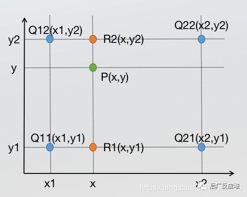

## 双线性插值

双线性差值本质就是两次单线性差值,也就是在两个方向计算了三次.



向这里就是Q代表的四个点分别加以权重然后对P点进行赋值.权重的取值本质上就是根据P点和四个点之间的距离来决定的

x方向上的两次单线性插值
$$
f\left(R_{1}\right)=\frac{x_{2}-x}{x_{2}-x_{1}} f\left(Q_{11}\right)+\frac{x-x_{1}}{x_{2}-x_{1}} f\left(Q_{21}\right)
$$

$$
f\left(R_{2}\right)=\frac{x_{2}-x}{x_{2}-x_{1}} f\left(Q_{12}\right)+\frac{x-x_{1}}{x_{2}-x_{1}} f\left(Q_{22}\right)
$$

y方向上的一次单次插值
$$
f(P)=\frac{y_{2}-y}{y_{2}-y_{1}} f\left(R_{1}\right)+\frac{y-y_{1}}{y_{2}-y_{1}} f\left(R_{2}\right)
$$
总结而言便是
$$
f(x, y)=\frac{f\left(Q_{11}\right)}{\left(x_{2}-x_{1}\right)\left(y_{2}-y_{1}\right)}\left(x_{2}-x\right)\left(y_{2}-y\right)+\frac{f\left(Q_{21}\right)}{\left(x_{2}-x_{1}\right)\left(y_{2}-y_{1}\right)}\left(x-x_{1}\right)\left(y_{2}-y\right)+\frac{f\left(Q_{12}\right)}{\left(x_{2}-x_{1}\right)\left(y_{2}-y_{1}\right)}\left(x_{2}-x\right)\left(y-y_{1}\right)
$$
因为根据前提,也就是双线性插值的前提,可以很简单的得到以下关系
$$
x_{2}=x_{1}+1 ; y_{2}=y_{1}+1
$$
将这个式子带回去,分母就全部都是1
$$
f(x, y)=f\left(Q_{11}\right)\left(x_{2}-x\right)\left(y_{2}-y\right)+f\left(Q_{21}\right)\left(x-x_{1}\right)\left(y_{2}-y\right)+f\left(Q_{12}\right)\left(x_{2}-x\right)\left(y-y_{1}\right)+f\left(Q_{22}\right)\left(x-x_{1}\right)\left(y-y_{1}\right)
$$
用这个式子就可以进行双线性插值的求解


## OpenCV实现

这里参考高博的方式,给出8位图像的双线性插值函数

```c++
inline float GetPixelValue(const cv::Mat &img, float x, float y) {
    if(img.type() == 0)
    {
        // 固定指针初始指向dst点左上角的点
        uchar *data = &img.data[int(y) * img.step + int(x)];
        float xx = x - floor(x);
        float yy = y - floor(y);
        return float(
            	// data[0] 左上角的点
                (1 - xx) * (1 - yy) * data[0] +
            	// data[1] 右上角的点
                xx * (1 - yy) * data[1] +
            	// data[img.step] 左下角的点
                (1 - xx) * yy * data[img.step] +
            	// data[img.step + 1] 右下角的点
                xx * yy * data[img.step + 1]
        ); 
    }
}
```

